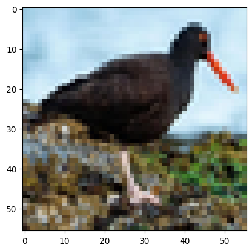
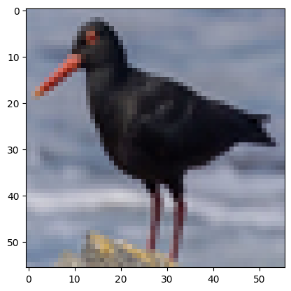
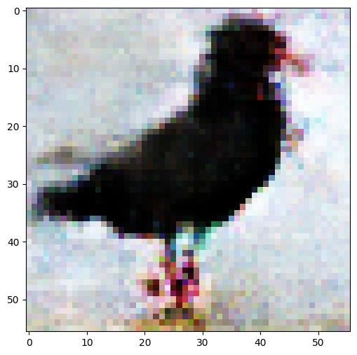
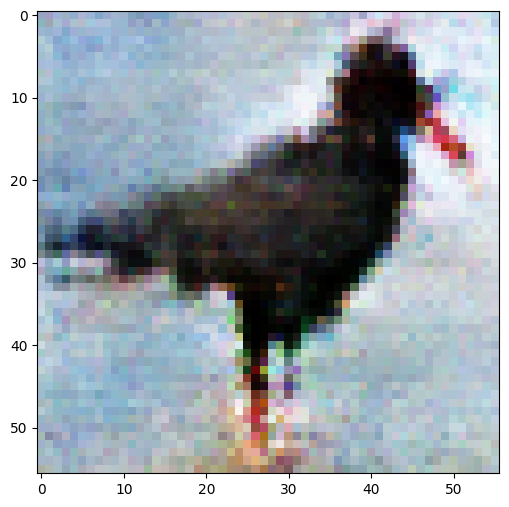

## GAN Bird Generator
This project aimed to create low resolution images of different bird species using a Generative Adverserial Network implemented from scrath using tensor flow. 

The LowResBirdGAN file contains the entire program while the other 3 .ipynb files break done the code into the key functionalities: Loading the image data from the training set, defining and training the GAN, and using the trained model to generate images. The .h5 files contain the trained models. 

### Training Samples vs Generated Outputs

  
  
  
  

  <em>Left: real training images | Right: generated bird images from the GAN</em>

This project was pretty succesful although we were limited to low resolution images. It gave us a good understanding of how to use Tensor Flow and a understanding of how GANs work.
